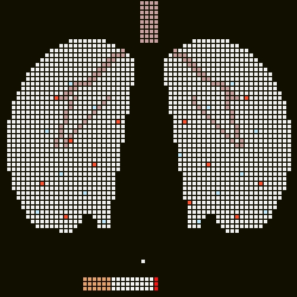

# ATTRITION 64



> *Attrition : the process of gradually reducing the strength or effectiveness of someone or
> something through sustained attack or pressure.*

**ATTRITION 64** is a pixel breakout game where the paddle is an everyday item, and the blocks form
the silhouette of something that the item is a threat to.  

**ATTRITION 64** gives an old school perspective on modern(ish) issues. The game makes no argument about
any of it. The sprites are the whole idea, feel free to adhere or not.

## Inspiration

There is this famous [anti smoking ad](https://www.reddit.com/r/interestingasfuck/comments/g9013u/antismoking_poster/)
that shows a cigarette as a paddle in a breakout game, with the blocks forming the silhouette of a
pair of lungs. One day I thought that this would make a fun game and started thinking
about what other pairings could be made.

## Playing

This is your regular breakout game: a paddle, blocks to destroy, a ball that bounces around and
power ups that drop from destroyed blocks. Several levels, playable on smartphone, desktop, with
finger, mouse or keyboard.

Play with it: https://ozh.github.io/attrition-64/

## Running it

The game is static files loaded as ES modules, so it must be served over HTTP - opening
`index.html` from `file://` will not work. Any static server will do.  
Example, from the project root:

```sh
python3 -m http.server 8000     # then open http://localhost:8000/
```

## Contributing

Pull requests are welcome!

If you want to add a level, read [docs/ADDING_A_LEVEL.md](docs/ADDING_A_LEVEL.md). Pull requests are welcome!

There is an editing tool: `tools/preview.html`. Load it through the same local server — for example
`http://localhost:8000/tools/preview.html`. Paste a level file into the textarea and
it renders as you type.

If you want to change something and want to know why it is that way, [docs/DESIGN.md](docs/DESIGN.md)
is the place to look.

## Tests

No dependencies and no test framework — Node's built-in runner, Node 18 or newer:

```sh
node --test 'test/*.test.js'
```

# License and AI usage

This is free software, under the MIT license.

I used Claude Code to help with several parts of the code: maths, tests, level validation and
base design. Feel free to copy any of the code here. I hope you will enjoy the level that
references this ;)
